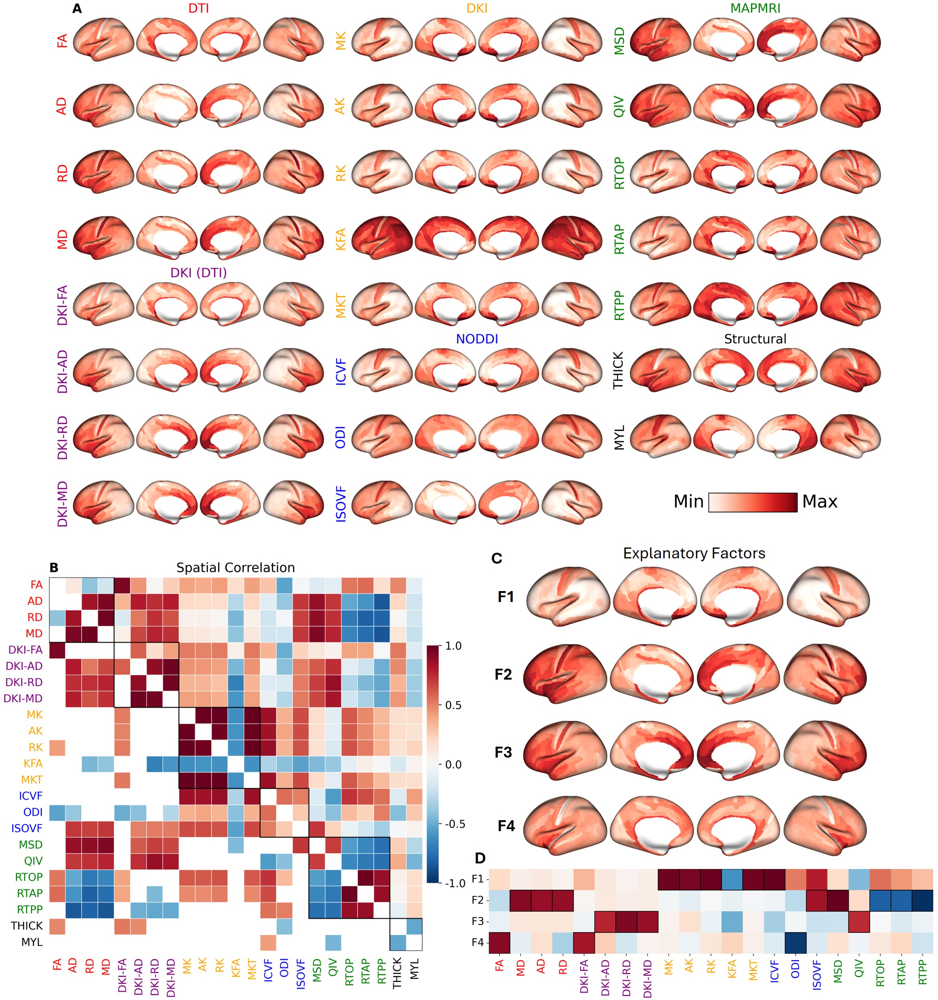

# diffusion_neuromaps
Code for microstructural mapping of the human cortex using diffusion MRI.  
See preprint at https://www.biorxiv.org/content/10.1101/2024.09.27.615479v2

## atlases
[atlases](atlases/) folder contains Glasser, DK, and various other maps/parcellations and coordinates

## data
[data](data/) folder contains all relevant data needed to run almost all the code. We do not provide subjectwise fsLR32k data due to the large data requirements but do provide code for generating the data once you have downloaded the HCP dataset. We do not provide the metadata for privacy reasons.
- [disorders](data/disorders/) has the ENIGMA case-control effect size maps
- [dk](data/dk/) has all the average, scn, and subject data parcellated by the DK atlas
- [dominance](data/dominance/) has the dominance analysis results
- [fslr_32k](data/fslr_32k/) has the average maps as fsLR32k surfaces
- [glasser](data/glasser/) has all the average, laterality index, intersubject coefficient of variation (CoV), test-retest CoV, and test-retest intraclass correlation coefficient (ICC)
- [heritability](data/heritability/) has the heritability results
- [mgh](data/mgh/) has data from the MGH-USC dataset
- [neuromaps](data/neuromaps/) has other Glasser and DK neuromaps
- [neuroquery](data/neuroquery/) has the fMRI activation maps from neuroquery
- [pet](data/pet) has PET receptor/transporter densities parcellated by Glasser and DK atlases
- [pls](data/pls/) has the PLS correlation analysis results
- [ridge](data/ridge/) has the CV ridge regression results

## plots
[plots](plots) folder contains all plots as .png files
- [dk](plots/dk/) has figures showing various dk maps
- [figs](plots/figs/) has figures showing the results of the analysis
- [glasser](plots/glasser/) has figures showing various glasser maps
- [mgh](plots/mgh/) has figures comparing the MGH and HCP data

## src
[src](src) folder contains all code used for the analysis.
- [disorder_corr](src/disorder_corr.py) performs multivariate analysis with disorder case-control maps
- [dk_parc](src/dk_parc.py) generates the DK parcellated data
- [dominance](src/dominance.py) performs dominance analysis (job-based)
- [factor_analysis](src/factor_analysis.py) performs factor analysis on the microstructural metrics
- [get_spherical_pts](src/get_spherical_pts.py) obtains the spherical coordinates used for spin-permutation testing
- [glasser_parc](src/glasser_parc.py) generates the Glasser parcellated data
- [gradients](src/gradients.py) computes laplacian embedding of SCNs and performs some analyses
- [load_disorders](src/load_disorders.py) loads the disorder case-control maps from ENIGMA
- [load_neuroquery](src/load_neuroquery.py) loads fMRI activations from the Cognitive Atlas using neuroquery
- [meg_corr](src/meg_corr.py) performs MEG univariate and multivariate correlation analysis
- [mgh_factor_analysis](src/mgh_factor_analysis.py) performs factor analysis on the MGH data
- [pet_corr](src/pet_corr.py) performs PET univariate and multivariate correlation analysis
- [plot_dominance](src/plot_dominance.py) plots the results from the dominance analysis
- [plot_explained_parc](src/plot_explained_parc.py) plots the proportion of the variation that each parcellation captures
- [plot_glasser_corr](src/plot_glasser_corr.py) performs similarity analysis among the microstructural metrics
- [plot_glasser_maps](src/plot_glasser_maps.py) plots the microstructural maps parcellated by the Glasser atlas
- [plot_glasser_par](src/plot_glasser_parc.py) plots the Mesulam, von Economo & Koskinas, Yeo, and SA axis parcel data
- [plot_heritability](src/plot_heritability.py) plots the twin-based heritability results
- [plot_mgh_corr](src/plot_mgh_corr.py) plots the correlation analysis and scatter plots comparing the MGH and HCP datasets
- [plot_mgh_maps](src/plot_mgh_maps.py) plots the MGH maps parcellated by the Glasser atlas
- [plot_ridge](src/plot_ridge.py) plots the CV ridge regression reults
- [pls_neuro](src/pls_neuro.py) performs PLS regression on the functional maps
- [pls_pet](src/pls_pet.py) performs PLS regression on the PET receptor/transport density maps
- [pls_score_analysis](src/pls_score_analysis.py) analyzes the PLS scores
- [ridge_reg](src/ridge_reg.py) performs repeated five-fold cross-validated ridge regression
- [sample_surfaces](src/sample_surfaces.py) does volume-to-surface mapping from co-registered dMRI metric volumes to fsLR32k surfaces
- [scn_connectivity](src/scn_connectivity.py) perfoms SCN connectivity analysis
- [scn_corr](src/scn_corr.py) correlates SCNs with FC & SC and gene & PET similarity and microstructure with their degree centrality
- [scn](src/scn.py) generates structural covariance networks (SCNs) for each microstructural metric
- [tools](src/tools.py) has various utility functions used throughout the other scripts

## Acknowledgements
Some sections of code are heavily borrowed from other repositories:  
See https://github.com/netneurolab/hansen_receptors/tree/main.  
HCP-YA and MGH-USC data can be accessed and downloaded at https://www.humanconnectome.org.  
HCP-YA structural and functional connectivity matrices, cortical thickness and surface area case-control effect size maps for the neuropsychiatric disorders investigated, and processed gene expression data from the Allen Human Brain Atlas can be found using the ENIGMA toolbox: https://enigma-toolbox.readthedocs.io/en/latest/.  
Volumetric PET images can be found at https://github.com/netneurolab/hansen_receptors or accessed using the neuromaps package: https://github.com/netneurolab/neuromaps.  
BigBrain related data can be found using the BigBrainWarp package: https://github.com/caseypaquola/BigBrainWarp.  
Other relevant cortical maps can also be found using the neuromaps package.